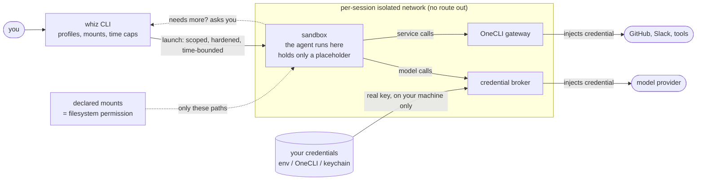

# Whizzard

[](https://github.com/BuckG71/whizzard/actions/workflows/ci.yml)

**Run powerful agent harnesses inside explicit, temporary, auditable permission boundaries — on your own machine.**

Whizzard wraps an *agent harness* — a tool that drives an LLM through real work (Hermes today; Claude Code, Cursor, and others to follow) — in a hardened, time-bounded Docker sandbox. Inside it, the agent reaches only the files you mounted and the network you allowed. It never holds your model or service credentials; those stay on your machine. And you stay in the loop: capabilities only narrow after launch, any escalation needs your approval, and every session leaves an audit trail you can read back.

```
Whizzard controls capabilities.
Agents request capabilities.
Agents do not grant themselves capabilities.
```

> **Status:** v0.1.0 OSS launch in preparation. Pre-release reviewers welcome — jump to [Quickstart](#quickstart).

---

## See the boundary

Launch a session on the `safe` profile — network off, nothing mounted:

```sh
whiz run --harness hermes --profile safe
```

Inside that sandbox the agent has **no network** (no DNS, no outbound anything) and can see **none of your files** — not `~/.ssh`, not your other projects, not your password manager — only the paths you explicitly mounted (here, none). Its model credential isn't in there either: on Whizzard's default `native` mode the sandbox holds only a placeholder while the real key stays on your machine, attached only when the call is forwarded to the model provider. When the session ends — or its time cap fires — the container is gone, and `~/.whizzard/logs/` holds a log of exactly what ran, with what access, and what the agent asked for mid-session.

That's the whole idea: **whatever the agent does, it can only do it within a capability surface you declared and can read back later.**

## Architecture at a glance



The sandbox is the untrusted boundary. It never shares a network with anything holding a raw secret, never sees a credential value, and cannot widen its own permissions — it can only *ask*, and you decide. Full treatment in [docs/architecture.md](docs/architecture.md) and the [visual overview](docs/reference/architecture-at-a-glance.html).

## What you get

- **Filesystem is opt-in.** The agent reaches only the paths you mounted — no parent-directory traversal, symlink, or glob trick reaches your home directory. The mount list *is* the permission model. Closes the whole "an agent ran `find ~ -name '*.pem'`" class.
- **Credentials never enter the sandbox.** A credential broker on your machine holds your real model key/login and attaches it only when forwarding to the model provider; the sandbox never sees the real value. If you use [OneCLI](https://onecli.sh), *every* service credential (GitHub, Slack, tool APIs) is injected on your machine too. A fully-compromised agent can neither read nor exfiltrate a secret it never holds. → [Credential privacy](#credential-privacy)
- **Network is a per-profile choice.** `off` = nothing (no DNS, no HTTP); `open` = full outbound access; `native` / `onecli` / `hybrid` = outbound only through a credential-injecting proxy. `off` closes data exfiltration entirely.
- **Privilege is contained.** Non-root user, all Linux capabilities dropped, read-only container root, `no-new-privileges`, Docker socket unreachable. A vulnerable tool the agent invokes gets no root, no host, no escape hatch.
- **Escalation is one-way, and you decide.** Permissions only narrow after launch. An agent that needs more surfaces a request to a file-mailbox you monitor; you approve or deny. No silent self-upgrade.
- **Sessions are time-bounded.** Every session carries a duration cap and an idle cap; when they fire, the container stops. Blast radius is the declared window.
- **Everything is audited.** An append-only log records what launched, with what profile and mounts, what was requested, how it resolved, and why it ended — and the sandbox can't reach the log to tamper with it.

## Credential privacy

**No credential of any kind ever enters the sandbox** — not your model key, not your service tokens. Whatever the agent uses, the real value stays on your machine and is attached to a request only as it leaves the sandbox for its real destination; inside the container there is only a placeholder. A fully-compromised agent cannot read or exfiltrate a secret it never holds.

You choose **how** credentials are handled, based on how you sign in. Pick one of three — `whiz init` walks you through it, or set it per session with `--credential-handling`:

- **`native`** — the default, no extra tools. Whizzard keeps your **model** credential out of the sandbox. Choose this if you don't need the agent to use service tokens (GitHub, Slack, tool APIs).
- **`onecli`** — [OneCLI](https://onecli.sh) keeps **every** credential out of the sandbox, model and services alike. Choose this if you use OneCLI and sign in to your model provider with an **API key**.
- **`hybrid`** — Choose this if you sign in to your model provider with **OAuth** (a subscription login rather than an API key). OneCLI can't handle OAuth logins, so Whizzard covers your model login while OneCLI covers your service tokens — both kept out of the sandbox.

OneCLI is opt-in — the way to extend the guarantee to your service tokens, not a requirement. If it's ever unavailable, a session still runs model-only with `--credential-handling native`. (The `off` and `open` profiles deliberately skip credential mediation — for untrusted work, or when you want broad, unmediated access.)

See the [decision log](docs/decisions.md) for the full credential-privacy rationale, and the [threat model](docs/threat_model.md).

## Quickstart

### Prerequisites

- macOS or Linux (Windows in pre-release verification), Python 3.11+, and a running Docker daemon.
- A supported agent harness **installed and configured first** — today that's [Hermes](https://github.com/NousResearch/hermes-agent). Whizzard sandboxes a harness you provide; it doesn't install one for you.

### Install + set up

```sh
pip install whizzard==0.1.0rc1
whiz init
```

`whiz init` walks five short steps, builds the sandbox images (~2 min first time), asks how to keep your credentials out of the sandbox, and writes config to `~/.whizzard/config/`. About five minutes total. If a Hermes profile exists at `~/.hermes/`, the wizard clones it (read-only, auth excluded) into a Whizzard profile; if not, it explains the setup and you run `whiz hermes profile create main` once Hermes is configured.

### First session

```sh
whiz                  # what's running + what you have set up
whiz r hermes         # launch a Hermes session (default: native, credential-private)
whiz --help           # every command
```

## Profiles

Bundled profiles (customize during `whiz init` or edit `~/.whizzard/config/profiles.json`):

| Profile | Network | Credentials | Time cap | For |
|---|---|---|---|---|
| `default` | on | **native** (key stays out of the sandbox) | none | everyday baseline |
| `build` | on | native | 2 h | development, long compiles |
| `power` | on (open) | full outbound, no mediation | 1 h | capability-heavy, broad access |
| `safe` | off | n/a | 30 min | running something you don't trust |
| `quarantine` | off | n/a | 30 min | untrusted, read-only folders only |

`whiz init` can set the default to `onecli` or `hybrid` if you use OneCLI.

## Scope and limitations

**Whizzard reduces risk; it does not eliminate it.** It bounds an agent **at runtime** — what it can reach while executing — a containment layer, not a complete security solution. In `v0.1.0` it deliberately does **not** address:

- **Deferred-execution via writable mounts** — an agent with write access can plant files (`.git/hooks/`, lockfiles, post-install scripts) that run later on the host. *Mitigation:* review diffs before commit; opt-in `--strict-overlay` review gate planned for v1.0 ([ROADMAP](ROADMAP.md) goal 10).
- **DNS-based exfiltration** when network is `on` — the on/off boolean doesn't gate DNS independently. *Mitigation:* use a network-`off` profile (`safe`/`quarantine`) for high-stakes work; per-profile constrained DNS under consideration ([ROADMAP](ROADMAP.md) goal 11).
- **Behavioral analysis, container escape, and supply-chain attacks on Whizzard itself** — out of scope; Whizzard relies on Docker / container-runtime boundaries and standard repo hardening, not novel sandboxing or third-party audit.

The **[full threat model](docs/threat_model.md)** gives the complete treatment with trust boundaries. This list names the gaps most likely to surprise someone who assumes "it's in Docker, so it's isolated." Found one that isn't listed? Please open an issue.

## Telemetry

**None.** No analytics, no crash reporting, no phone-home — nothing leaves your machine except the network traffic your agent sessions make under the policy you set. The only files Whizzard writes are your local config and audit log. A capability-governance tool that quietly exfiltrated data would be self-defeating; there is no analytics dependency in the codebase.

## Project status

Early (0.1.x), solo-maintained, and deliberately narrow: it sandboxes one harness (Hermes), pinned to a tested build. Held to a real bar — hardened, tested, documented — but support is best-effort with no SLA. For sensitive work, use the pinned-version install and read [Scope and limitations](#scope-and-limitations).

The engineering rationale is documented in the open, in an append-only decision log ([docs/decisions.md](docs/decisions.md), D-1 → D-191) — the credential-privacy design, for instance, is D-183 through D-191.

## Documentation

- [docs/vision_and_strategy.md](docs/vision_and_strategy.md) — what this is, who it's for, where it's going
- [docs/reference/architecture-at-a-glance.html](docs/reference/architecture-at-a-glance.html) — visual overview (open in a browser)
- [docs/threat_model.md](docs/threat_model.md) — threat model and trust boundaries
- [docs/architecture.md](docs/architecture.md) — system structure, safety policy, adapter contract
- [docs/decisions.md](docs/decisions.md) — append-only decision log
- [ROADMAP.md](ROADMAP.md) — v1.0 goals + post-launch sequencing

## Contributing / development

```sh
git clone https://github.com/BuckG71/whizzard && cd whizzard
python3 -m venv .venv && source .venv/bin/activate
pip install -e ".[dev]"
make check            # lint + typecheck + test in one shot
```

Individual targets: `make test`, `make lint`, `make fmt`, `make typecheck`, `make validate-decisions`. Pre-commit hooks: `pip install pre-commit && pre-commit install`. See [CONTRIBUTING.md](CONTRIBUTING.md).

## A note on naming

**Whizzard** is the project; **`whiz`** is the short CLI alias — both invoke the same tool. The name is settled.
